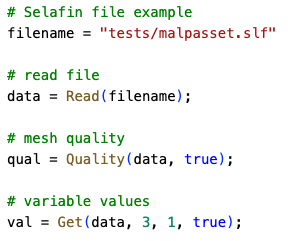
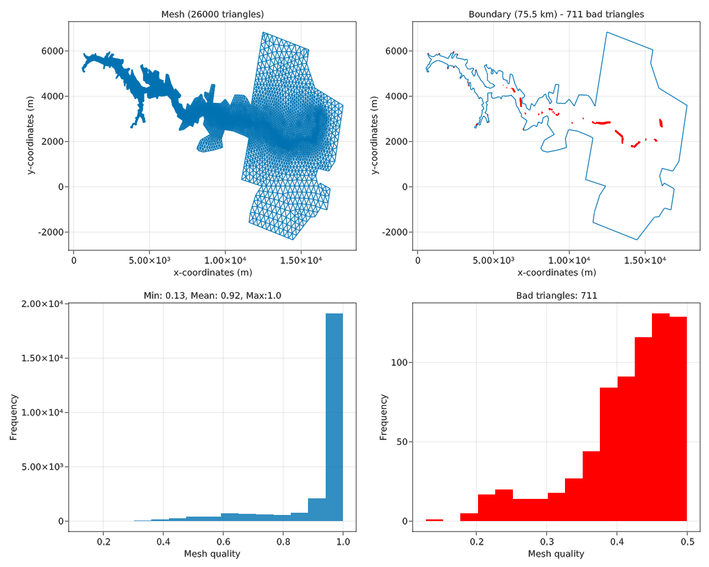
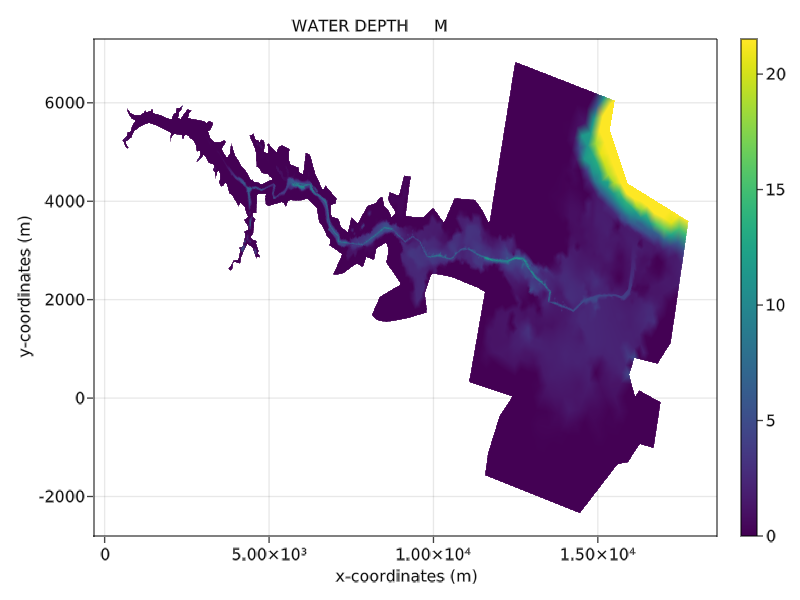

Telemac Selafin file reader in Julia
====================================

This program a reader and viewer of the Telemac Selafin file (www.opentelemac.org) in the Julia programming language

Purpose: get info on the Telemac result file (values and mesh)

Use
===

Three user's functions are defined to read the Selafin file, get info on the mesh quality, and get results at the desired time info.

The following code is an example use on a Telemac 2D file:

  

The latter will give the following print out:

  

and the following figures for the mesh quality:

  

 and for the 2D results of the water depth:

  

Requirements
============

- Julia v1.6 or above

Julia package Dependencies
==========================

- GLMakie
- Dates
- BenchmarkTools
- StatsBase

License
=======

This package is provided under the MIT license

Contributions
=============

Contributions are always welcome ;-)

When contributing to **Selafin.jl** please consider discussing the changes via the issue tab.
