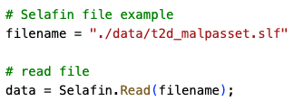
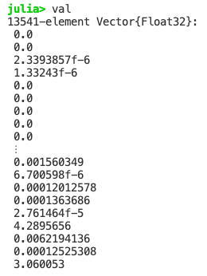
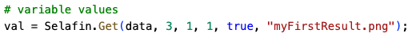
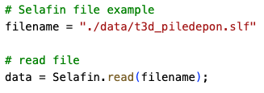

Telemac Selafin file reader in Julia
====================================

This program is a reader and viewer of the Telemac Selafin file (www.opentelemac.org) in the Julia programming language.

Purpose: get info on the Telemac result file (2D/3D values and 2D mesh)

## Telemac 2D example

Three user's functions are defined in order to read the Selafin file, get info on the mesh quality, and get results at the desired time info and layer.

The following code is an example use on a Telemac 2D file. The first step is to read the Selafin file with the *Read()* function:

  

This will display the following information on the file:

  

And in return, the user will have access to a Julia data structure:

  

The mesh can be analyzed with the *Mesh()* function by giving the data structure:

  

The mesh quality is then displayed with the following histogram:

  

The mesh can also be viewed by adding the logical parameter:

  

  

To get the results on the water depth, the *Get()* function has to be used. Here, the water depth is the variable number 3. As only one time step is available, the call will be:

  

In return, the user will have access to a vector (1D real array):

  

The result can also displayed and saved as an image by adding the logical parameter and a file name (png format required):

  

  

## Telemac 3D example

The logic is the same. Firstly, we will read the case:

  

This will display the following information on the file:

  

This case has 4 variables, 9 time steps and 6 layers.

The mesh can also be analyzed and viewed by adding the logical parameter:

  

  

Finally, in order to get and see the vertical velocity (*w*), at the time step number 5 and for the layer no. 6, the function call will be:

  

  

Requirements
============

- Julia v1.6 or above

Julia package dependencies
==========================

- GLMakie
- Dates
- BenchmarkTools
- StatsBase

License
=======

This package is provided under the MIT license

Contributions
=============

Contributions are always welcome ;-)

When contributing to **Selafin.jl** please consider discussing the changes via the issue tab.
