

  
  
  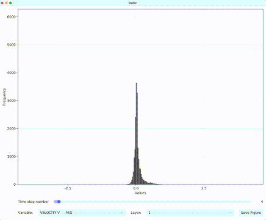
  
  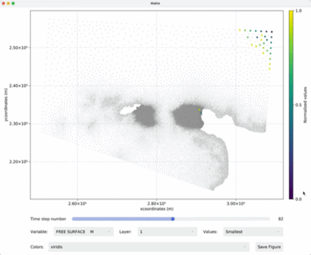

Telemac Selafin file reader in Julia
====================================

This program is a reader and GPU-powered viewer (using GLMakie) of the [Telemac](www.opentelemac.org) Selafin file in the Julia programming language.

Purpose: get info and analyze the Telemac 2D/3D results (values and mesh)

## Using Selafin.jl

First, install *Selafin.jl* with the package manager:

  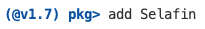

Then use *Selafin.jl* from the Julia REPL:

  

## Telemac 2D example

Three user's functions are defined in order to read the Selafin file, get info on the mesh quality, and get results at the desired time info and layer.

The following code is an example use on a Telemac 2D file. The first step is to read the Selafin file with the *Read()* function:

  

This will display the following information on the file:

  

And in return, the user will have access to a Julia data structure:

  

The mesh can be analyzed with the *Quality()* function by giving the data structure:

  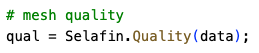

The mesh quality is then displayed with the following histogram:

  

The mesh can also be viewed by adding the logical parameter:

  

  

To get the results on the water depth, the *Get()* function has to be used. Here, the water depth is the variable number 3. As only one time step is available, the call will be:

  

In return, the user will have access to a vector (1D real array):

  

The result can also displayed and saved as an image by adding the logical parameter and a file name (png format required):

  

  

## Telemac 3D example

The logic is the same. Firstly, we will read the case:

  

This will display the following information on the file:

  

This case has 4 variables, 9 time steps and 6 layers.

The mesh can also be analyzed and viewed by adding the logical parameter:

  

  

Finally, in order to get and see the vertical velocity (*w*), at the time step number 5 and for the layer no. 6, the function call will be:

  

  

## Get the variables

Six functions allow to get the values of the variables:

- *Get* and *GetAllTime* for values on the whole mesh

- *GetNode* and *GetNodeAllTime* for values on a single node of the mesh

- *GetXY* and *GetXYAllTime* for values on a point whose coordinates are given by the user

## Plot the variables

It is possible to plot the listed variables of Telemac interactively (see video above) with the following function:

  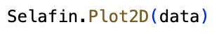

For the velocity field, use the following function to see the corresponding vector plot:

  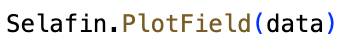

As for the other plots, it is possible to zoom in and out and export the image to a file.

And for a simple 3D interactive plot of the bottom elevation, use the following function:

  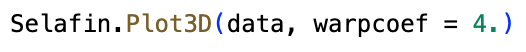

  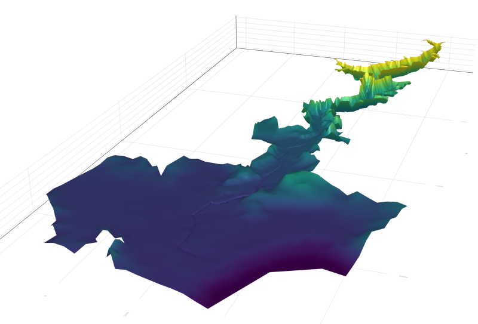

## Histogram

It is also possible to interactively visualize the histograms of all variables as a function of time with the command:

  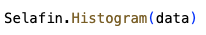

## Extrema

Only the largest or the smallest values of a single variable are dynamically selected and displayed when using the *Extrema()* function. For instance, to show only the top ten values, use the following code:

  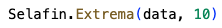

## Correlation

Time-dependent correlations are computed and plotted by using:

  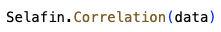

By saving the image file, a linear regression will also be calculated.

## Statistics

The minimum and maximum values as well as the means and medians are provided with the following function:

  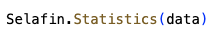

Requirements
============

- Julia v1.6 or above

Julia package dependencies
==========================

- [GLMakie](https://makie.juliaplots.org/stable/)
- [GeometryBasics](https://juliageometry.github.io/GeometryBasics.jl/stable/)
- [StatsBase](https://juliastats.org/StatsBase.jl/stable/)
- [Dates](https://docs.julialang.org/en/v1/stdlib/Dates/)
- [FFMPEG_jll](https://github.com/JuliaBinaryWrappers/FFMPEG_jll.jl)

License
=======

This package is provided under the MIT license

Contributions
=============

Contributions are welcome.

When contributing to **Selafin.jl** please consider discussing the changes via the issue tab.
